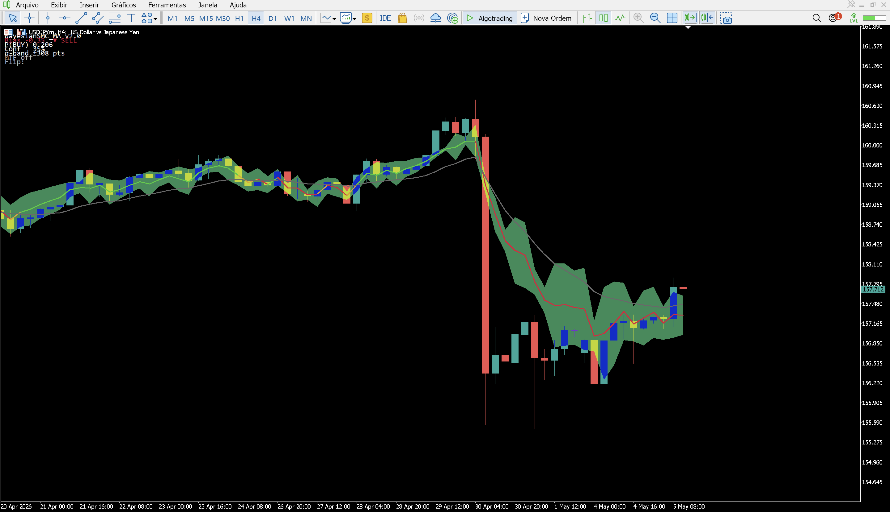

# Bayesian Adaptive Moving Average — MT5

> Média móvel adaptativa de nível institucional para MetaTrader 5, dirigida por inferência Bayesiana sobre 6 evidências de mercado, com banda de incerteza σ-driven, fusão multi-timeframe via prior Bayesiano e suavização Kalman-style adaptativa por convicção.

[]()
[]()
[]()
[]()
[](LICENSE)

---

## Sobre

**Bayesian Adaptive Moving Average** é a evolução institucional da minha abordagem Bayesiana para Smart Money Concepts: em vez de só plotar setas e zonas, o motor agora **vira média móvel** — uma linha contínua que se desloca em função da **convicção** do mecanismo Bayesiano e cuja banda de incerteza ao redor representa diretamente o desvio padrão da posterior Bernoulli `P(BUY)` calculada barra a barra.

A linha é **adaptativa**: quando o motor está confiante (P perto de 0 ou 1), ela se torna responsiva e segue o preço de perto. Quando o motor está indeciso (P perto de 0.5), ela suaviza e fica estável — eliminando praticamente todo whipsaw em mercado lateralizado.

---

## Capturas de tela



_Indicador rodando em USDJPY H4. A nuvem verde-clara é a banda σ (largura proporcional à incerteza), a linha colorida é a média Bayesiana adaptativa (azul = neutro, verde = bias buy, vermelho = bias sell, dourado = transição), a linha cinza pontilhada é a EMA base. As barras coloridas no fundo do gráfico mostram regime de mercado calculado bar-a-bar. Painel superior mostra `P(BUY)`, σ-band em pontos, MTF prior e idade do último flip._

---

## Recursos — 5 elevações de qualidade vs. v1

### 1. Banda Bayesiana de Incerteza (σ-driven cloud)
Cada barra produz uma posterior Bernoulli `P(BUY) ∈ [0,1]` com desvio σ = √(P·(1−P)). A banda de cloud em volta da linha tem largura `σ · ATR · BandWidth` — **colapsa** quando o motor está confiante (P→0 ou 1) e se **expande** no centro (P=0.5). É a visualização direta da convicção do motor por barra.

### 2. MTF Bayesian Fusion (higher-TF prior em log-odds)
Usa o **Trend evidence** em uma TF maior (default H4) como **prior Bayesiano**, somando ao logit local com peso configurável. A álgebra de log-odds é a forma canônica de combinar duas fontes independentes de evidência — cada barra do TF do gráfico consulta o bar correspondente da MTF via `iBarShift()`.

### 3. Adaptive Smoothing (Kalman-style com gain bias-driven)
$$\alpha_t = \alpha_{\min} + (\alpha_{\max} - \alpha_{\min}) \cdot |\text{bias}_t|^2$$

Quando o motor está em sinal forte (`|bias|≈1`), α se aproxima de `α_max` → linha **responsiva**. Quando indeciso (`|bias|≈0`), α cai para `α_min` → linha **estável**. Resultado: zero whipsaw em chop, máxima reatividade em tendência.

### 4. Structure com fractais reais + BoS
A v1 usava `close[i] − close[i−K]` como proxy. Agora detectamos **swing highs/lows** via fractais N-bar e medimos **BoS local** (close atual rompendo o último swing) com peso decaindo exponencialmente em barras desde o break. Posição relativa do close ao mid do range entre swings também contribui.

### 5. Painel + alertas
Painel compacto com bias%, P(BUY), confiança, MTF prior, σ-band em pontos e idade do último flip. Alertas opcionais em flip de viés e cruzamento preço × linha — anti-spam por barra.

---

## Robustez de implementação

- **13 validações de input** em `OnInit`
- **7 handles** (chart: EMA fast/slow, RSI, ATR, VolMA + MTF: EMA fast/slow), todos checados e liberados em `OnDeinit`
- **CopyBuffer** com `ResetLastError` + `GetLastError` em todos
- **BarsCalculated()** conferido antes de copiar
- **Recompute incremental:** `prev_calculated` → recalcula só novas barras
- **EMPTY_VALUE** explícito em warmup; sem linha-fantasma à esquerda
- **Anti-spam de alertas:** 1 por barra fechada, gate em `time[]`
- **Painel limpo seletivo** em `OnDeinit` (preserva em `PARAMETERS`/`CHARTCHANGE`)

---

## Instalação

1. Faça download do arquivo [`BayesianSMC_MA.mq5`](BayesianSMC_MA.mq5).
2. No MetaTrader 5, abra **Arquivo → Abrir Pasta de Dados**.
3. Copie o arquivo `.mq5` para `MQL5/Indicators/`.
4. Na janela **Navegador** do MT5, clique direito em **Indicadores → Atualizar**.
5. Arraste **BayesianSMC_MA** para o gráfico desejado.

> **Compilação:** se o indicador não aparecer compilado, abra-o no MetaEditor (F4 no MT5) e pressione **F7** para compilar.

---

## Parâmetros principais

### Engine
| Parâmetro | Default | Descrição |
|---|---|---|
| `InpEMAFast` | 20 | EMA rápida (linha base) |
| `InpEMASlow` | 50 | EMA lenta (Trend evidence) |
| `InpRSIPeriod` | 14 | Período do RSI |
| `InpATRPeriod` | 14 | Período do ATR |
| `InpVolumeMA` | 20 | MA do volume |
| `InpStructureLookback` | 60 | Barras para buscar fractais |
| `InpFractalDepth` | 2 | Profundidade do fractal (clássico = 2) |
| `InpLiqLookback` | 10 | Barras para sweep detection |

### MTF Bayesian Prior
| Parâmetro | Default | Descrição |
|---|---|---|
| `InpMTFPeriod` | H4 | Timeframe maior (PERIOD_CURRENT desliga MTF) |
| `InpMTFWeight` | 0.6 | Peso do MTF prior na fusão |

### Pesos Bayesianos
| Evidência | Peso default |
|---|---|
| Trend (EMA fast vs slow) | 1.0 |
| Momentum (RSI) | 1.0 |
| Structure (BoS via fractais) | **1.3** |
| Imbalance (FVG) | **1.1** |
| Liquidity (sweeps) | **1.2** |
| Volume | 0.8 |

### Linha + Banda + Smoothing
| Parâmetro | Default | Descrição |
|---|---|---|
| `InpDisplacement` | 1.0 | Multiplicador ATR para bias |
| `InpBandWidth` | 1.5 | Multiplicador ATR para banda σ |
| `InpAlphaMin` | 0.10 | Smoothing baseline (incerto) |
| `InpAlphaMax` | 0.55 | Smoothing máximo (motor confiante) |
| `InpNeutralThreshold` | 0.15 | Threshold do bias considerado neutro |

---

## Como funciona

```
Preço + Volume + Tempo
        │
        ▼
┌─────────────────────────────────────┐
│ Extrai 6 evidências por barra       │
│   Trend, Momentum, Structure,       │
│   Imbalance, Liquidity, Volume      │
└─────────────────────────────────────┘
        │
        ▼
┌─────────────────────────────────────┐
│ Cada evidência → log-likelihood     │
│ Soma ponderada → logit local        │
└─────────────────────────────────────┘
        │
        ▼ (se MTF ligado)
┌─────────────────────────────────────┐
│ MTF prior (Trend em H4) + logit     │
│   logit_total = local + w · prior   │
└─────────────────────────────────────┘
        │
        ▼
┌─────────────────────────────────────┐
│ Sigmoid → P(BUY)                    │
│ bias = 2·P − 1 ∈ [−1, +1]           │
└─────────────────────────────────────┘
        │
        ▼
┌─────────────────────────────────────┐
│ α_t = α_min + (α_max−α_min)·|bias|² │
│ MA_t = α_t · MA_input + (1−α_t)·    │
│        MA_{t-1}                     │
└─────────────────────────────────────┘
        │
        ▼
┌─────────────────────────────────────┐
│ σ = sqrt(P·(1−P))                   │
│ Banda = MA ± σ · ATR · BandWidth    │
└─────────────────────────────────────┘
```

### Por que MTF prior em log-odds?

O grande problema de combinar sinais de timeframes diferentes é que eles têm **escalas e correlações diferentes** — somar um RSI de M15 com um RSI de H4 distorce. A álgebra de log-odds resolve isso de forma elegante:

$$\text{logit}_{\text{total}} = \text{logit}_{\text{local}} + w \cdot \text{logit}_{\text{MTF}}$$

Como `logit = log(P/(1−P))`, somar logits é equivalente a multiplicar likelihoods independentes — exatamente o que o **teorema de Bayes** prescreve para combinar duas fontes de evidência. Aplicando o sigmoid no final, recuperamos uma probabilidade calibrada que respeita ambas as fontes.

---

## Aviso

Este indicador foi desenvolvido para fins **educacionais e de estudo**. Não constitui recomendação de investimento e não garante resultados financeiros. Operações no mercado financeiro envolvem risco de perda. Use em conta demo antes de qualquer aplicação em conta real, e nunca arrisque mais do que pode perder.

---

## Licença

Distribuído sob a [Licença MIT](LICENSE).

---

## Autor

**Hugo Pereira de Sousa**

Estudante de Ciência de Dados e Inteligência Artificial — IESB (Brasília-DF). Foco em análise de dados, IA aplicada e indicadores quantitativos para mercado financeiro.

- LinkedIn: [hugo-sousa-901b2b342](https://www.linkedin.com/in/hugo-sousa-901b2b342)
- GitHub: [@hugopsousa-dev](https://github.com/hugopsousa-dev)
